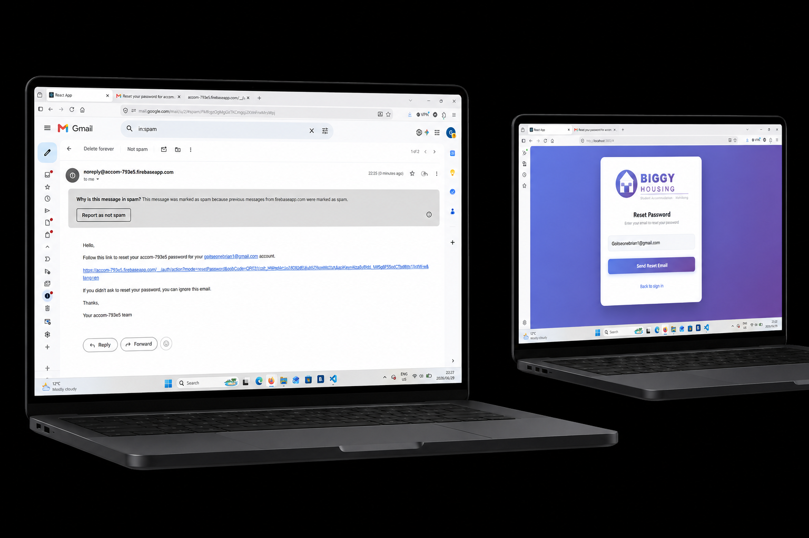
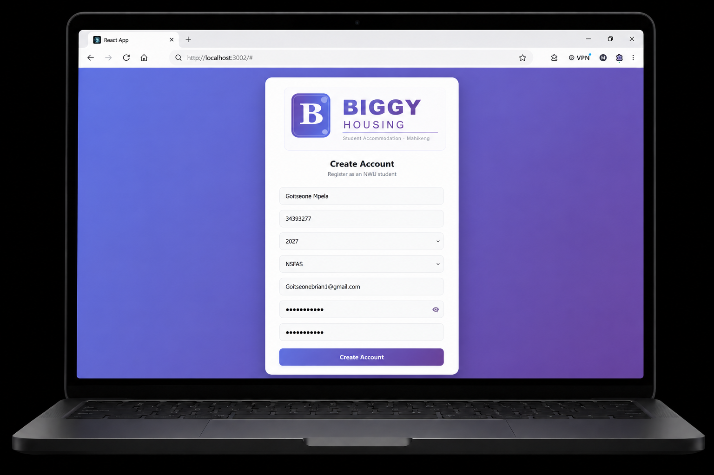
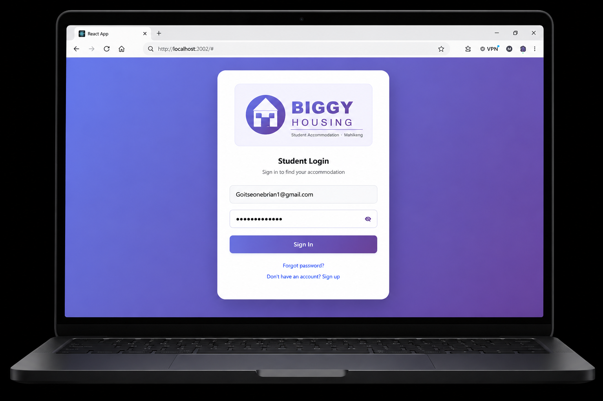
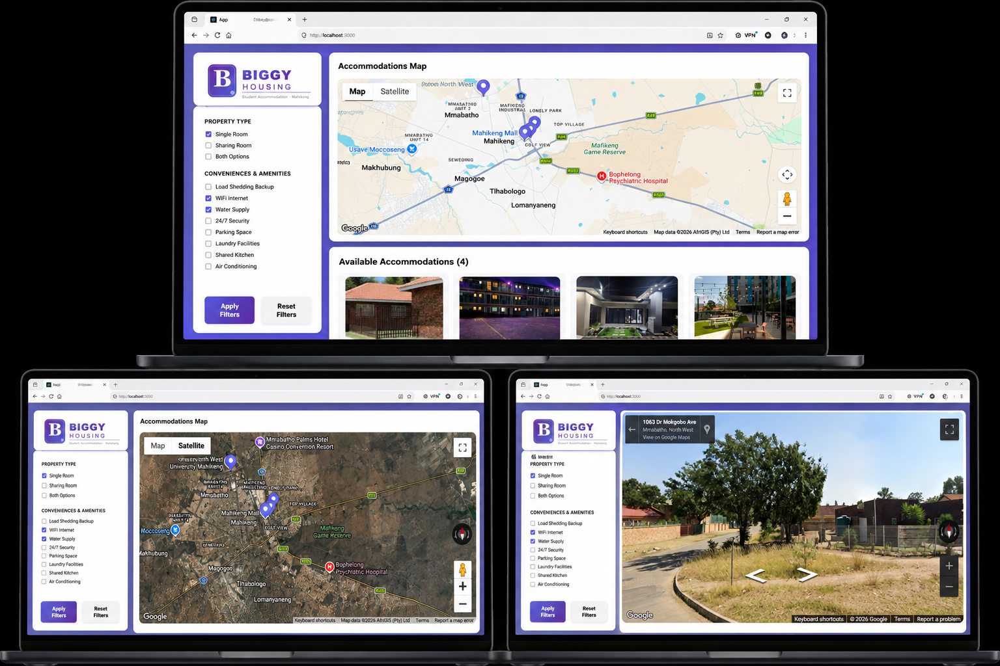
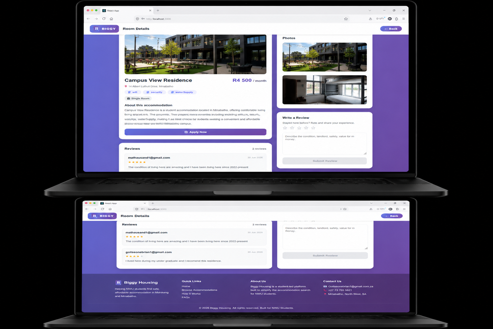
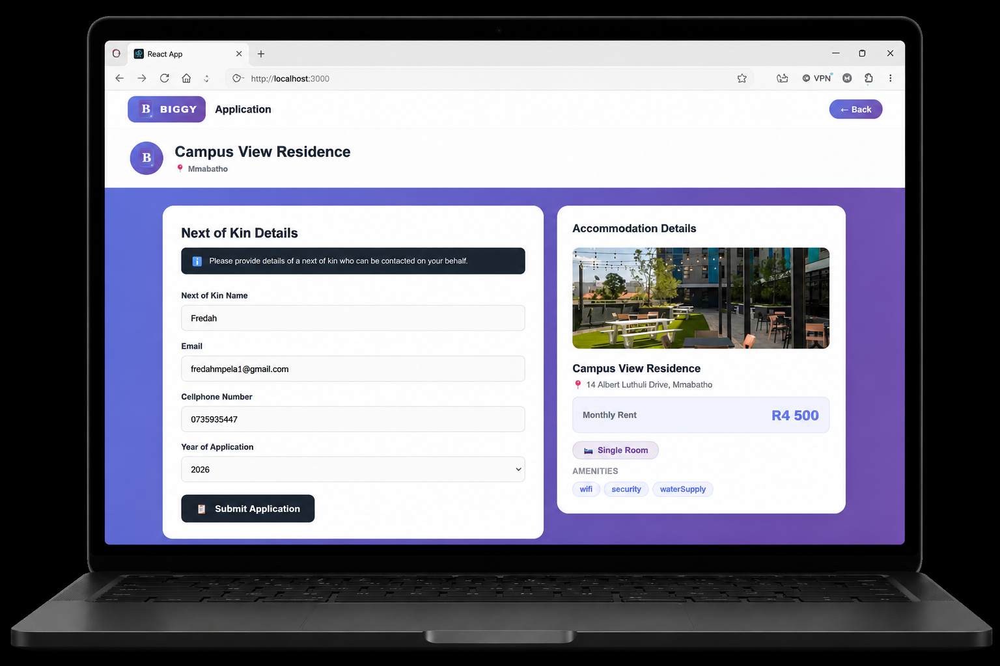

# Off-Campus Accomodation
#### The Off-Campus Accomodation system aims to solve the challenges students face when searching for accomodation near the university.This is achieved through a web based information systemthat allow students to search,view and apply for available accomodation while sitting at home.The system include a real time map and filters features that help students view locations around campus, compare available options, and select accomodation that best suit their needs.
## UI Preview:

  

