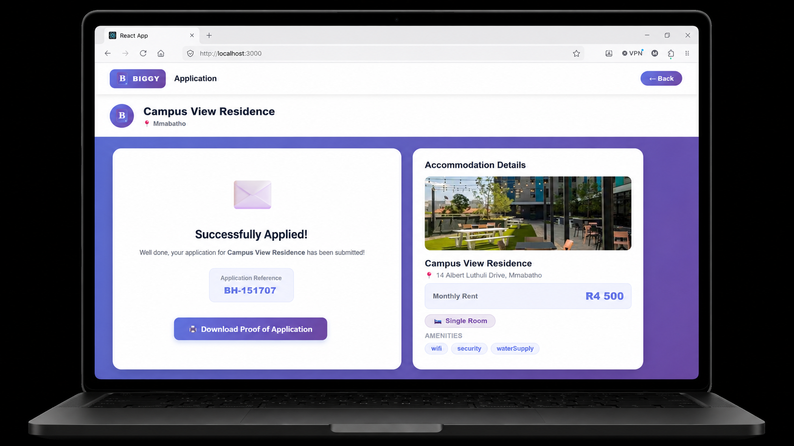
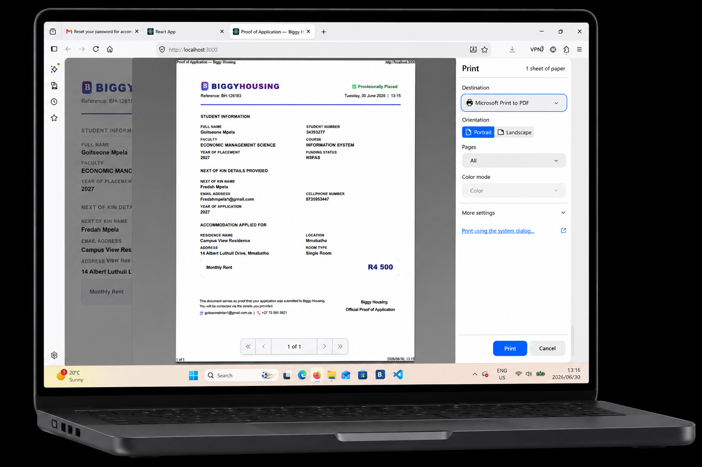

#### The Off-Campus Accomodation system aims to solve the challenges students face when searching for accomodation near the university.This is achieved through a web based information systemthat allow students to search,view and apply for available accomodation while sitting at home.The system include a real time map and filters features that help students view locations around campus, compare available options, and select accomodation that best suit their needs.
## UI Preview:

  

### The following Technologies were used:

<ul>
  <li>React Custom Hooks</li>
  <li>React Context</li>
  <li>React Styled Components</li>
</ul> 
## System Architecture:
#### I have built The application following a <a href="https://blog.cleancoder.com/uncle-bob/2012/08/13/the-clean-architecture.html" target="_blank">Clean Architecture</a> design phillosophy by <a href="http://cleancoder.com/products" target="_blank">@Uncle Bob martin</a> to bring about separation of concerns between the Business logic layer and  the Presentation layer to allow for high Perfomance, Maintanability and  Testibility.

